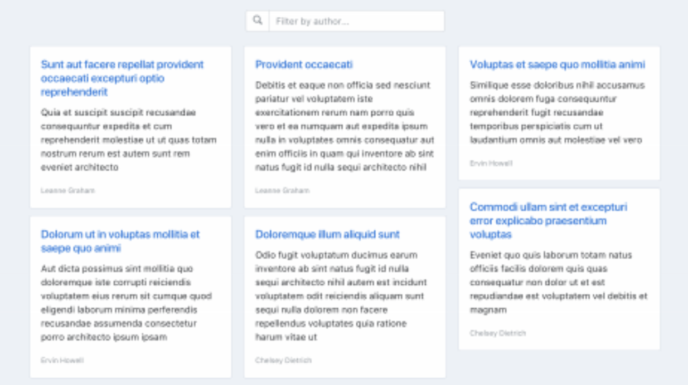
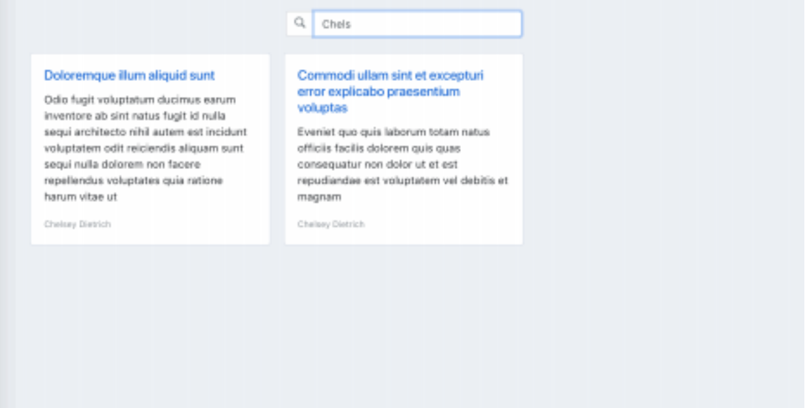

# Тестовое задание на вакансию Frontend разработчик
## Задача: разработать одностраничное приложение, которое позволяет получать,  отображать и фильтровать данные с внешнего REST API.

Источник данных - онлайн-сервис jsonplaceholder.typicode.com/
Необходимо получить и отобразить список публикаций /posts

И добавить фильтрацию по автору публикации. Список авторов получать в /users

Также нужно предусмотреть возможность корректного отображения страницы на  разных устройствах. Другими словами, сделать адаптивную верстку.

## Требования к технологиям

В качестве фреймворка рекомендуется использовать Vue.js, однако это не строгое  требование. Если вы предпочтете решить задачу с помощью React или Angular - это не будет ошибкой, но предпочтительно Vue 2 / 3, поскольку основная работа будет именно на Vue

Для верстки рекомендуется Bootstrap 4, но также допускается использование  любого другого CSS-фреймворка на ваш выбор. Рекомендуется использовать  препроцессоры для стилей (SASS, LESS).

Дизайн макетов, представленных во вложении не обязательно повторять в точности  до пикселя. Достаточно воспроизвести общий концепт

